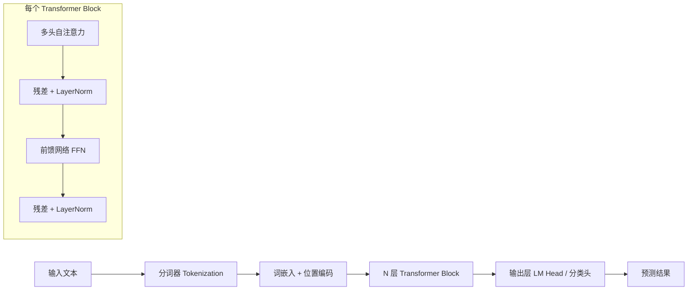

# 06 · Transformer 原理白话速览

> 本篇是 [05-transformer-from-scratch](./05-transformer-from-scratch.md) 的**概念入门/快速复习版**：
> 不写代码、不推导实现，只用直觉和类比把 Transformer 的核心思想讲透。
> 适合第一遍建立心智模型，或者面试前 10 分钟快速过一遍。
> 想看公式推导、从零手写实现（RoPE / KV cache / FlashAttention），请移步 05。

---

## 1. 一句话总结

Transformer 是 2017 年 Google 论文《Attention Is All You Need》提出的架构。
它彻底抛弃了 RNN 的循环结构，**完全依赖注意力机制（Attention）处理序列**，
因此可以并行计算、能捕捉任意距离的依赖关系——这是它统治现代 AI 的根本原因。

---

## 2. 整体流程

整个模型就是把这个 Block 堆 N 层（GPT-2 是 12 层，LLaMA-70B 是 80 层），
结构高度均匀——这也是它容易 scale 的原因之一。

---

## 3. 自注意力（Self-Attention）：核心中的核心

每个 token 的向量会被三个矩阵投影成三种角色：

| 角色 | 含义 |
|---|---|
| **Q (Query)** | 我在找什么信息 |
| **K (Key)** | 我能提供什么信息 |
| **V (Value)** | 我实际携带的内容 |

$$
\text{Attention}(Q, K, V) = \text{Softmax}\!\left(\frac{QK^\top}{\sqrt{d_k}}\right)V
$$

**直观理解**：对句子

> "The animal didn't cross the street because **it** was too tired"

计算 "it" 的新表示时，注意力会自动给 "animal" 分配高权重——模型由此"理解"了指代关系。
每个词的新表示是**全句所有词的加权平均**，权重由相关性（Q·K 点积）决定。

两个细节：

- 除以 $\sqrt{d_k}$：防止点积过大导致 Softmax 进入饱和区、梯度消失。
- 因果掩码（Causal Mask）：生成式模型里，每个词只允许看到它左边的词（防止"偷看答案"）。

---

## 4. 多头注意力（Multi-Head Attention）

不是只算一次注意力，而是把向量切成 8 / 16 / 32 个"头"，
每个头在不同的子空间里**独立**计算注意力，最后拼接起来。

不同的头会学到不同的关系模式：有的关注语法结构，有的关注指代，有的关注相邻词。
类比：同一句话让多个专家从不同角度各看一遍，再汇总意见。

---

## 5. 位置编码：注意力本身是"无序"的

注意力对输入顺序不敏感（打乱词序、注意力输出的集合不变），所以必须显式注入位置信息：

- 原始论文：正弦/余弦绝对位置编码
- 现代模型（LLaMA / Qwen / DeepSeek）：**RoPE 旋转位置编码**——把位置信息编码成向量的旋转角度，对长文本外推更友好

---

## 6. 前馈网络 + 残差连接

每层注意力之后跟一个两层 MLP（先升维约 4 倍再降回来），对每个位置独立做非线性变换。
一个常见的直觉：**Attention 负责"token 之间交换信息"，FFN 负责"每个 token 自己消化信息/存储知识"**。

残差连接（`x + f(x)`）和 LayerNorm 让几十上百层的网络能稳定训练——梯度有"高速公路"可以直通底层。

---

## 7. 三种架构变体

| 架构 | 注意力方式 | 代表模型 | 适合任务 |
|---|---|---|---|
| Encoder-only | 双向（每个词看到全句） | BERT | 分类、NER、检索 |
| Decoder-only | 单向因果掩码（只看左边） | GPT / LLaMA / Qwen | 文本生成，**当今 LLM 主流** |
| Encoder-Decoder | 编码双向 + 解码单向 | T5 / BART | 翻译、摘要 |

Decoder-only 模型生成文本是**自回归**的：每次预测下一个 token，拼回输入再预测下一个，循环往复。
配合 **KV Cache** 缓存已算过的 K/V，避免每步重复计算整个前缀（详见 05 的实现）。

---

## 8. 为什么 Transformer 赢了 RNN？

| 维度 | RNN / LSTM | Transformer |
|---|---|---|
| 并行化 | 逐词串行处理 | 一次矩阵乘法处理整个序列，训练快几个数量级 |
| 长距离依赖 | 信息逐步传递、逐层稀释 | 任意两词"一步直达"，无梯度衰减 |
| 可扩展性 | 难以做大 | 架构简单均匀，堆参数堆数据持续提升（Scaling Law 的基础） |

**代价**：注意力计算量随序列长度平方增长 $O(n^2)$。
这正是 FlashAttention、滑动窗口注意力、线性注意力等优化技术出现的原因（详见 05 §FlashAttention 和模块 07）。

---

## 9. 与 HuggingFace Transformers 库的关系

[03-huggingface-transformers](./03-huggingface-transformers.md) 里的 `transformers` 库就是这套架构的工程化封装：

- `AutoTokenizer`：负责分词（文本 → token IDs）
- `AutoModel*`：加载上面这些层的预训练权重
- `pipeline`：把"分词 → 前向计算 → 解码输出"整条链路包装成一行代码

库名就直接来自这个架构。

---

## 10. 延伸阅读

- 公式推导与从零实现：[05-transformer-from-scratch](./05-transformer-from-scratch.md)
- 现代 LLM 对基础架构的改进（GQA / MoE / RMSNorm 等）：[09-frontier-models/01-llm-architectures](../09-frontier-models/01-llm-architectures.md)
- 原始论文：[Attention Is All You Need (2017)](https://arxiv.org/abs/1706.03762)
- 可视化讲解：[The Illustrated Transformer](https://jalammar.github.io/illustrated-transformer/)
